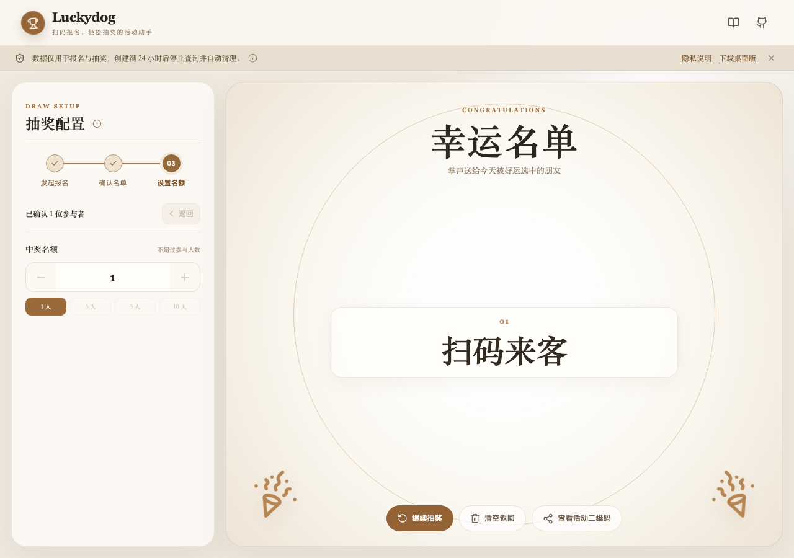
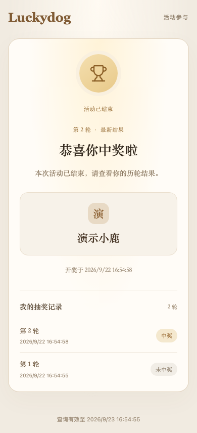

<div align="center">
  
  <h1>Luckydog 🐾</h1>
  <p><strong>今天谁是幸运儿？点一下就知道。</strong></p>
  <p>Sites 与 Windows / Mac 桌面版均支持扫码报名、抽奖和个人结果查询</p>
  <p><a href="https://luckydog-draw.jadey-owo.chatgpt.site/">🎲 Sites 在线版</a> · <a href="https://github.com/Jadey-ovo/luckydog/releases/latest">📦 下载桌面版</a> · <a href="public/privacy.html">🔒 隐私说明</a></p>
</div>



周会抽个小礼物，活动选几位幸运观众，或者决定今天谁来分享。奖品请自己准备，Luckydog 负责揭晓。

## 在线活动三步走

1. 选择 5、10 或 30 分钟报名时长，分享二维码或邀请链接。
2. 实时查看名单，到期自动截止；提前截止、移除参与者都需要确认。原截止时间前可以继续报名。
3. 确认名单与名额后抽奖。参与者使用报名时的浏览器打开原链接，中奖显示“恭喜你中奖啦”，未中奖得到明确反馈，未参与者只看到活动已结束。

同一轮不重复中奖。“继续抽奖”会从完整名单重新抽取，可能重复上一轮中奖者，原链接突出显示最近一次成功同步的结果，并保留本人每轮中奖或未中奖记录。同步失败会提示重试。网页和桌面版使用相同的邀请流程。



## 报名期限与查询期限

| 情况 | 行为 |
| --- | --- |
| 报名开放 | 按所选 5 / 10 / 30 分钟截止，不因心跳、恢复报名或重抽延长 |
| 提前 / 自然截止 | 停止报名，参与者可查看本人信息并等待开奖 |
| 开奖成功 | 新增一轮结果，活动仍在进行；原链接自动显示本人最新结果和每轮记录 |
| 开奖后刷新 / 关闭发起页面 | 最后一次在线续期约 90 秒后活动结束；结果仍可查询，刷新后不能恢复管理 |
| 未开奖时关闭 / 刷新 / 长时间断网 | 最后一次续期约 90 秒后标为中断，停止报名与开奖；保留本人报名信息至 24 小时，不会冒充已开奖 |
| 清空返回 | 二次确认后结束活动、重置本页配置，历史链接与本人每轮记录保留至原 24 小时期限；新活动生成新链接与二维码 |
| 创建满 24 小时 | 立即拒绝查询和修改；自动清理活动、关联名单与每轮记录 |

未开奖时请保持发起页面打开和联网。后台休眠也可能使连接中断，恢复后需返回重新发起。返回重新发起失败时保留页面并提示错误，可重试；服务端已经过期时也可重置本页配置。无人报名到期后可在配置区返回重新发起。

参与者只收到自己的用户名与每轮中奖状态；完整名单和结果只有持管理凭据的发起人可访问。识别使用 HttpOnly Cookie，更换设备、无痕窗口或清除 Cookie 后无法查询原身份，也不提供按姓名搜索。被移除的用户不再有本人结果。链接不是完整中奖名单的公开分享。

## 想先试试，还是装进电脑？

**[打开 Sites 在线版](https://luckydog-draw.jadey-owo.chatgpt.site/)**，无需注册，无需安装。

桌面版自带运行环境。抽奖界面和抽奖计算在本机运行；创建扫码邀请时需要联网，并通过 Sites 临时同步报名名单与开奖结果。

桌面应用会自动检查 GitHub Release。新版本下载完成后会提示重启安装；如果系统限制自动替换，则会引导到官方下载页。

| 你的电脑 | v1.4.0 安装包 | 打开方式 |
| --- | --- | --- |
| Windows 10 / 11，64 位 x64 | [下载 EXE](https://github.com/Jadey-ovo/luckydog/releases/download/v1.4.0/Luckydog-1.4.0-win-x64.exe) | 双击，按安装向导操作 |
| Mac，Apple 芯片 M 系列 | [下载 DMG](https://github.com/Jadey-ovo/luckydog/releases/download/v1.4.0/Luckydog-1.4.0-mac-arm64.dmg) | 打开后拖入「应用程序」 |
| Mac，Intel 芯片 | [下载 DMG](https://github.com/Jadey-ovo/luckydog/releases/download/v1.4.0/Luckydog-1.4.0-mac-x64.dmg) | 打开后拖入「应用程序」 |

[全部版本与更新说明](https://github.com/Jadey-ovo/luckydog/releases) · [下载文件校验值](https://github.com/Jadey-ovo/luckydog/releases/download/v1.4.0/SHA256SUMS.txt)

目前的安装包未做开发者签名及 Apple 公证，系统可能提示未知开发者或阻止打开。受管理的公司电脑可能限制运行，可以先用网页版。Mac 两种架构已在 Apple 芯片机器上启动验证，其中 Intel 版通过兼容运行验证；Windows 安装包已构建，尚未在 Windows 实机验证。

## 数据与隐私

在线版的用户名、匿名浏览器标识和每轮开奖结果保存在 Sites 托管 D1，活动记录最多可访问 24 小时，重置发起页不会提前删除历史记录。Cookie 最长保存 7 天，只用于浏览器识别与去重。发起人管理凭据仅保留在页面内存，不写入网址或本机存储。

Sites 不配置定时清理任务，过期数据在后续 API 请求时自动清理（每个运行实例最多每小时触发一次）；无请求期间可能仍物理存储，但 API 始终禁止访问过期记录。独立 Worker 通过每小时定时任务清理。平台备份、恢复历史、访问 IP 与请求日志由托管方另行管理，不等同于应用记录删除。

桌面版的界面与随机抽取在本机运行。用户主动创建在线邀请后，桌面程序只允许连接固定的 Luckydog Sites 接口，并临时同步报名用户名、匿名参与者标识和每轮结果；这些数据遵循相同的 24 小时查询期限。桌面网页本身仍不能访问任意网络地址。自动更新访问 GitHub 安装包。应用没有广告、埋点或统计 SDK。详见 [隐私说明](public/privacy.html)。

兼容旧版的独立 `/api/results` 主动公开分享接口仍采用约 90 秒在线租约，关闭后失效；它不是邀请活动的个人查询接口，当前在线邀请流程不会使用它。

## 随机方式

抽奖使用 `crypto.getRandomValues`、拒绝采样与 Fisher-Yates 洗牌。滚动名字只负责展示。本工具没有第三方审计或防篡改证明，正式抽奖请另行记录活动规则。

## 本地开发和验证

使用 Node.js 24 与 npm。

```sh
npm ci
npm test
npm run test:worker
npm run test:dev
npx playwright install chromium
npm run test:web
npm run test:desktop
```

`npm run dev:worker` 构建页面、迁移本地 D1 并启动完整网站；运行中新增 SQL 迁移会先停止服务，应用成功后自动重启。迁移失败或已有迁移被修改时会停止并提示修复，不重置本地数据。`npm run dev` 仅启动前端，接口需另开 Worker。测试使用隔离数据库与虚构名单，不访问线上数据。桌面测试只启动开发 Electron，不生成安装包。

`npm run build` 类型检查并生成静态页面；`npm run build:sites` 生成本地 Sites 产物，不部署。`LUCKYDOG_TEST_SITES=1 npm run test:worker` 验证打包后的 Sites 入口与 Drizzle 迁移。两套迁移必须追加同步，已发布迁移不可改写。

详见 [开发说明](docs/DEVELOPMENT.md)、[活动记录设计](docs/ACTIVITY-HISTORY-24H.md)、[访问统计中文对照](docs/analytics-request-map.md) 与 [发布说明](docs/RELEASING.md)。推送 GitHub 分支不会自动更新 Sites。

发现问题请 [提 Issue](https://github.com/Jadey-ovo/luckydog/issues)，使用虚构名单，勿提交真实个人信息。
